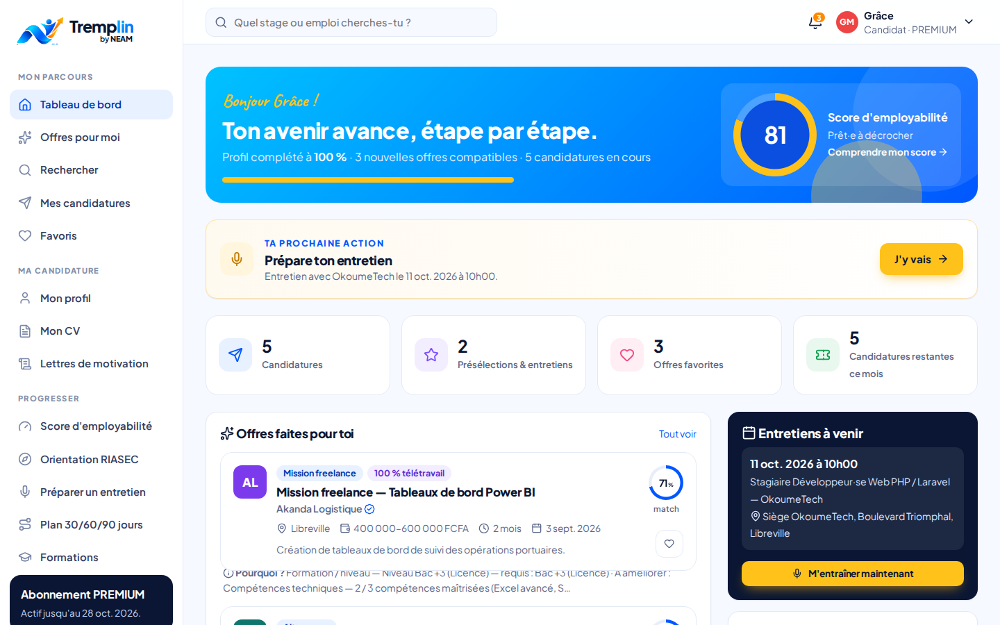
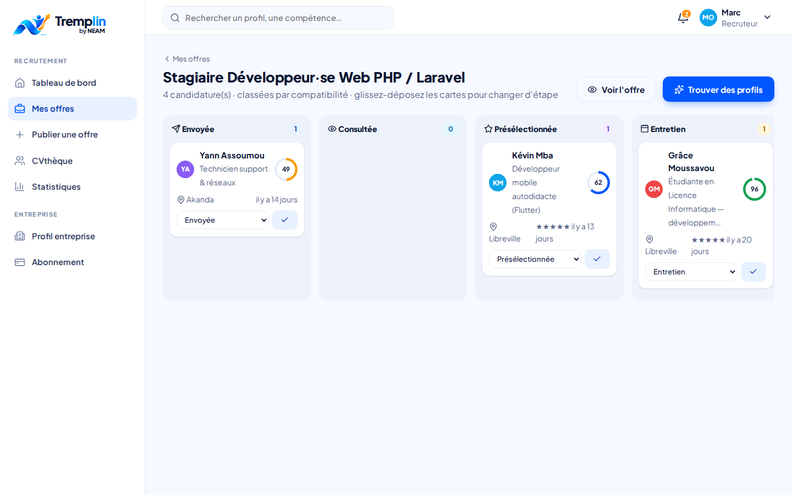
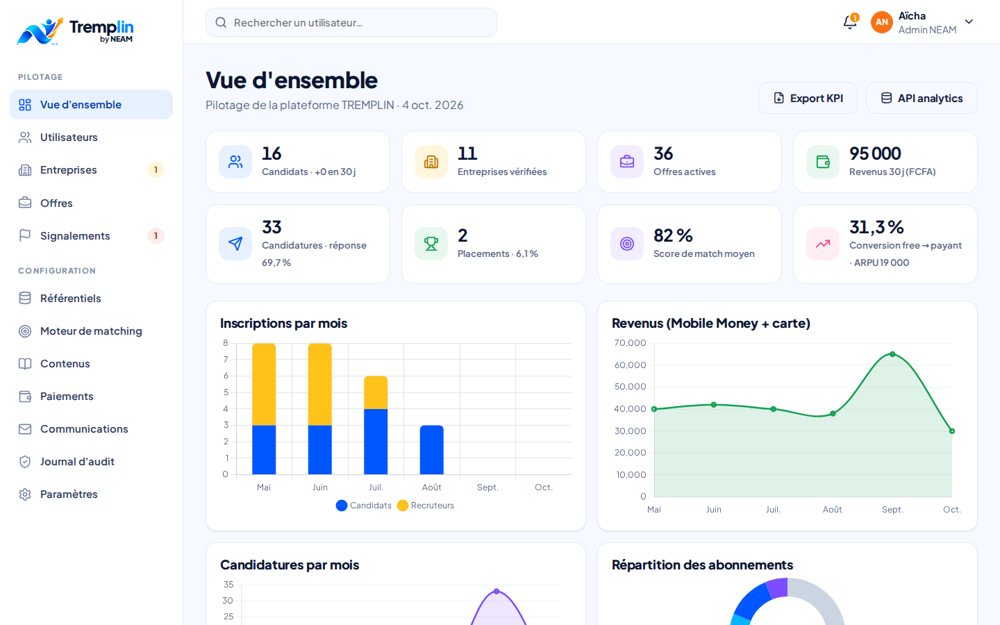

# TREMPLIN by NEAM

**Transformer le potentiel en opportunités.**

Plateforme d'insertion professionnelle pour le Gabon et l'Afrique francophone : stages, premiers emplois et alternances, avec un moteur de **matching explicable** entre candidats et entreprises, un accompagnement à l'employabilité (CV, lettres, orientation RIASEC, préparation d'entretien) et des espaces dédiés aux entreprises, aux écoles et à l'équipe NEAM.


Écrit en **PHP 8.2+ natif**, sans framework, pour tourner aussi bien sur un hébergement mutualisé que sur un serveur cloud.

---

## Démarrage rapide (2 minutes)

```bash
php bin/install.php                                  # crée la base SQLite et les données de démonstration
php -S localhost:8000 -t public public/index.php     # lance le serveur
```

Ouvrir http://localhost:8000. Au premier lancement, la base SQLite est aussi créée automatiquement si elle n'existe pas.

### Comptes de démonstration

Mot de passe commun : `Tremplin2026!` (les boutons « Comptes de démonstration » sur la page de connexion connectent en un clic).

| Espace | E-mail | Ce que vous y verrez |
|---|---|---|
| Candidate | `candidat@tremplin.ga` | Grâce, étudiante en Licence informatique : tableau de bord, offres classées par compatibilité, CV, candidatures, entretien programmé |
| Recruteur | `recruteur@tremplin.ga` | OkoumeTech : pipeline Kanban, matching des profils, CVthèque, statistiques |
| École | `ecole@tremplin.ga` | ISNG : suivi des stages, statistiques par filière, diffusion d'offres, export |
| Admin NEAM | `admin@tremplin.ga` | Back-office : modération, référentiels, poids du matching, paiements, audit |

Les entreprises, écoles et personnes de démonstration sont fictives.

---

## Fonctionnalités (cahier des charges V1.0)

### Candidat
- Inscription par e-mail, connexion par e-mail ou téléphone, onboarding en 3 étapes, profil complet : formations, expériences, compétences avec niveau, langues (A1–C2), mobilité, préférences
- **CV automatique** en 3 modèles (Moderne, Classique, Créatif), impression / PDF, **historique des versions**
- **Import de CV** (PDF, DOCX, TXT) avec détection automatique des compétences
- **Lettres de motivation** adaptées à chaque offre (moteur NEAM ou Claude)
- Recherche multicritère, favoris, candidature directe ou redirection externe, suivi en 7 étapes, messagerie avec le recruteur, rappels de relance
- **Score d'employabilité explicable** (8 facteurs), **test RIASEC** contextualisé Gabon avec métiers recommandés, **simulateur d'entretien** (méthode STAR) avec feedback, **plan d'action 30/60/90 jours**

### Entreprise
- Inscription, vérification par NEAM (RCCM), profil public
- Offres : création, modification, duplication, archivage, critères de matching (compétences clés / pondérées, niveau éliminatoire, langues, qualités)
- **Pipeline Kanban** en glisser-déposer (avec alternative clavier), notes internes, évaluation, invitation à un entretien
- **Profils compatibles** classés par score avec explications, **CVthèque** (coordonnées masquées tant que le candidat n'a pas postulé), invitation à postuler
- Statistiques : vues, candidatures, conversion, délais de présélection et de recrutement

### École / université
- Code établissement pour rattacher les étudiants, invitations par e-mail
- Tableau de suivi des stages (recherche → candidature → placement → convention → stage → fin)
- Statistiques par filière et par secteur, insertion des diplômés, partenariats entreprises, diffusion ciblée d'offres, **export CSV**

### Back-office NEAM
- Dashboard (utilisateurs, offres, candidatures, placements, revenus, conversion free → payant, ARPU)
- Comptes et rôles, modération des entreprises et des offres, signalements
- Référentiels multi-pays : compétences, métiers (RIASEC), secteurs, villes, pays, formations
- **Configuration des poids du matching** par secteur, simulateur et indicateurs de calibrage
- Paiements, codes promo, grille tarifaire, contenus éditoriaux, journal des communications et des appels IA, **journal d'audit**, exports CSV

### Moteur de matching (§8)
Score de 0 à 100 sur 9 critères pondérés (compétences 30 %, formation 15 %, expérience 15 %, métier 10 %, localisation 10 %, disponibilité 5 %, langues 5 %, soft skills 5 %, préférences 5 %). Les poids sont configurables par secteur. Le niveau d'étude obligatoire est traité comme critère **éliminatoire**. Chaque résultat expose le détail par critère, les points forts, les écarts et des **actions recommandées** (formations ciblées, projets, conseils). Code : `app/Services/MatchingEngine.php`.

### Monétisation (§12)
Offres FREE, STARTER (2 000 FCFA), PRO (5 000), PREMIUM (10 000), CAREER (15 000), offres entreprises et licence école. Paiement **Airtel Money / Moov Money / carte** : le pilote `sandbox` simule la confirmation opérateur. L'activation se fait dans une transaction, avec facture.

### API REST v1 (§16)
Endpoints JSON authentifiés par jeton Bearer : `/api/v1/auth/login`, `/jobs`, `/jobs/{id}/apply`, `/matches`, `/recommendations`, `/cover-letter/generate`, `/interview/simulate`, `/companies/jobs`, `/companies/candidates/search`, `/admin/analytics`… Spécification OpenAPI 3 : `/api/v1/openapi.json`, documentation : `/api`.

```bash
curl -X POST http://localhost:8000/api/v1/auth/login -H "Content-Type: application/json" \
  -d '{"login":"candidat@tremplin.ga","password":"Tremplin2026!"}'
```

---

## Aperçus

| Espace candidat | Pipeline recruteur | Back-office NEAM |
|---|---|---|
|  |  |  |

---

## Configuration

Copier `.env.example` vers `.env`. Les principaux paramètres :

| Variable | Rôle |
|---|---|
| `DB_DRIVER` | `sqlite` (par défaut), `mysql` ou `pgsql` |
| `APP_DEMO` | `false` en production pour masquer les comptes de démonstration |
| `MAIL_DRIVER` | `log` (messages visibles dans Admin › Communications) ou `mail` |
| `AI_PROVIDER` | `local` (moteur NEAM à base de règles, sans clé) ou `anthropic` |
| `PAYMENT_DRIVER` | `sandbox` tant qu'aucun agrégateur Mobile Money n'est branché |

### Activer Claude (optionnel)

```bash
composer require anthropic-ai/sdk guzzlehttp/guzzle
```

Puis dans `.env` : `AI_PROVIDER=anthropic` et `ANTHROPIC_API_KEY=…`. Si l'API est indisponible ou refuse une requête, la génération bascule automatiquement sur le moteur local. Le score de matching n'utilise jamais l'IA générative. L'assistant se désactive depuis Admin › Paramètres.

### Production (MySQL)

```bash
cp .env.example .env    # puis DB_DRIVER=mysql, DB_HOST, DB_NAME, DB_USER, DB_PASSWORD, APP_DEMO=false
php bin/install.php --no-seed
```

La racine web doit pointer sur `public/`. Sur un hébergement mutualisé où ce n'est pas possible, le `.htaccess` racine redirige vers `public/` et bloque les dossiers sensibles. Le dossier `storage/` doit être accessible en écriture.

---

## Sécurité (§17)
Mots de passe hachés (`password_hash`), sessions `HttpOnly` / `SameSite` régénérées à la connexion, **jeton CSRF** sur tous les formulaires, requêtes préparées uniquement, échappement systématique des sorties, en-têtes de sécurité (CSP, X-Frame-Options…), **RBAC** par rôle et cloisonnement des données (un recruteur ne voit que les candidatures reçues ; une école, ses étudiants), **limitation de débit** (connexion, inscription, API, uploads), uploads contrôlés (taille, extension, type MIME réel, analyse, stockage hors racine web, téléchargement autorisé), journal d'audit, export JSON des données personnelles et suppression du compte.

## Architecture

```
app/
  Core/         Routeur, middlewares (auth, rôles, CSRF, API, throttle), DB (PDO), vues, validation
  Services/     MatchingEngine, EmployabilityService, RiasecService, Ai/ (local + Claude),
                NotificationService, PaymentService, PlanService, Uploader, JobSearch…
  Controllers/  Public, Auth, Candidate/, Company/, School/, Admin/, Api/
  Views/        Gabarits PHP (layouts public / espace connecté / impression)
database/       schema.php (portable SQLite/MySQL/PostgreSQL), seed.php, Migrator
public/         index.php (contrôleur frontal), assets (CSS, JS, icônes Lucide, polices, Chart.js)
storage/        base SQLite, uploads privés, logs
```

Les services externes (IA, e-mail, SMS/WhatsApp, paiement) sont encapsulés derrière des services internes : on peut changer de fournisseur sans toucher au reste du produit.

## Feuille de route suggérée
- Brancher un agrégateur Mobile Money (webhook signé à la place du sandbox) et un fournisseur SMS/WhatsApp
- 2FA pour les administrateurs, file d'attente pour les e-mails et les alertes quotidiennes/hebdomadaires
- Applications mobiles sur l'API v1, extension multi-pays

---

© NEAM Softwares Industry — Libreville, Gabon
